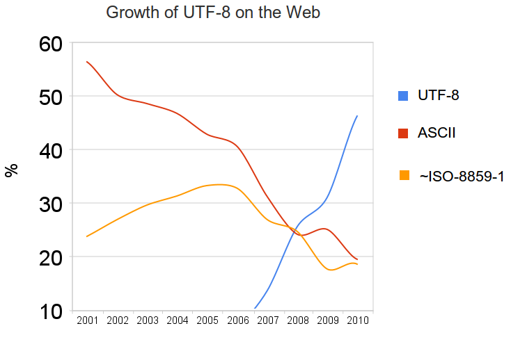

# Lecture 2: Digital Text Production

Let's build up a conceptual model of digital text production, from the ground up.

We will proceed in four 'movements' -- with some breaks in between.


## Movement 1. Alphabets, ASCII, and Unicode

"In the beginning was the Word"

A 'Word' = a Byte. 8 bits. 1010 1010.

How do we make bytes -- collections of binary digits ("bits"), numbers --  into something useful, like text? We just have agree on a system; it's just a convention. This was a thing people sorted out originally in the 1950s.

There needed to be -- across all computer systems makers -- a general agreement that a particular number, represented as a byte (in 8-bits,a number between 0 and 255, between 0 and 11111111, or more conveniently, in hex, between 0 and FF), stands for a particular letter of the alphabet.[^hex]

The ASCII -- the "American Standard Code for Information Interchange" was an enormously successful standard -- still with us today for better or worse, after 63 years (1963). 

Capital 'A' is ASCII code 65 -- or 41 in hex (right?) -- 'B' is 66, and so on.


ASCII has a limited number of possibilities, though:

How many letters in the English alphabet? 26  
x2 for upper and lowercase - 52  
+ ten digits - 62  
+ 30 punctuation marks - 92  
+ 30-odd control codes for early systems - 127  
+ the last binary bit reserved for error control - 255  

So ASCII is an alphabet with 127 possible characters. Sounds great, what could possibly go wrong? 

Any language other than English, that's what goes wrong.

To get around the anglocentrism of the ASCII standard, a variety NON-standard schemes emerged: "extended character sets." Apple had one, Microsoft had a different one. IBM had another. Various standards were proposed (e.g., ISO 8859) but never uniformly adopted.

But a mess, generally. And non-Europeans (e.g. all Asian languages) were still utterly left out.


### Unicode

A solution came forward circa 1997, in the **Unicode** standard, which could encode a possible 1,112,064 possible characters

The simplest Unicode implementation, UTF-8, made for an easy replacement for ASCII. Based on fixed 8-bit chunks (up to 4 chunks, for a million characters), and "a UTF-8 file that contains only ASCII characters is identical to an ASCII file" because the first 127 possibilities are the same as in the ASCII standard.

But implementations were/are still complex. This is literally like changing the alphabet from under us.



Unicode is supported by pretty much everything now. Mac OS X, Windows, Unix and Unix-derived operating systems. XML, HTML, and the Web and Internet standards.

But legacy systems are still with us. Old software (esp critical databases) sometimes don't get updated, and so stuff still messes up.

If you see little rectangles instead of letters, or these things -- � -- something in your toolchain has failed to support your Unicode.

The failures are few and far between these days. So Unicode support means is that you can type accented characters, and curly quotes, and em-dashes, and greek, and whatever without having to worry about it. But this is recent -- only the past 10 or 15 years.

You used to have to write  U+2014 or `&#x2014;` or `&mdash;` but with Unicode, you can just type an em-dash. On the Mac, shift-option-hyphen.

And, of course, you can also write in Arabic or Bengali, or whatever.


### Code-points vs glyphs:

Note that a Unicode "code-point" is not a **glyph**. A code-point is an abstract representation of a character in the Unicode system. A glyph is an actual visual mark. So, individual glyphs -- for instance, **ligatures** -- are actually defined in individual font files, not in the Unicode standard. 

In all the fonts in the world, there are only a tiny handful that represent most of the Unicode space. Pay attention to what Unicode support your typefaces include. Old fonts often only support the ASCII character set plus some accented vowels. Newer fonts are better, but you still have to think about it.

If you're working with an Indigenous language, for instance...


### Line breaks

Once we have an alphabet we can all agree on, we can put text in files and expect it to be readable. Except there's one more catch...

The original, most basic structural element in text files is the **line break**. Also known as "carriage return". Unfortunately, in ASCII (and Unicode), there are two of them: both **line feed** (LF, from teletype) and **carriage return** (CR, from typewriters) are represented. 

And if there are two ways to do things, people will do both. Or either. And so, historically, some systems used LF, some CR, and some, unfortunately (Microsoft!), BOTH. 

This is not a huge hassle, but something to be aware of. For the most part, it just works, because most software is smart enough to do the right thing with whatever version of line breaks are present.

The old Unix practice for text files was regular line breaks (LF) making lines about 70–80 characters long, to fit on a screen. Early text editor software edited one line at a time. 

Later, after decent display technology came along, and the "word wrap" feature became normal, people stopped breaking lines at the 80-character mark, and instead could allow lines go as long as they need to be. So today, in a text file (like this one), an entire paragraph would be one "line" even though, when you look at it on screen, it's wrapped into several visual lines. 

You're probably so used to this, that it takes a minute to think about what this means: "Lines" are sequences of text separated by line breaks. What you see on your screen as a line, though, may be a single long line "soft-wrapped" so that it fits within the margins or the window. Almost all software has decent paragraph-wrapping algorithms in it. Some are very sophisticated, like typesetting routines that can hyphenate and control for widows and orphans. Some are simple, and just wrap lines between words when needed.

A good text editor, with line numbering, makes this easy and obvious.


## Movement 2. Understanding Markup

Beyond lines, any attempts to put more structure into text files requires the use of some kind of special **delimiter** to make it possible to distinguish between regular content and information *about* the content. 

A *delimiter* is a thing that limits. A really good example is in English prose. A period is a delimiter that marks a sentence end. Quotation marks are another familiar example. These delimiters were designed for human beings to parse. But we can "mark up" digital text with other delimiters to give it structure.

"Markup" is a very old idea. As far back as the 15th century, for instance, the copy that was handed to a typesetter or compositor would be the "fair copy" of the text plus some extra markings that indicated formatting: make the title centred on the page; set this part in a bigger face; break the page here; indent this part; and so on. The standard set of "copyeditor's marks" are derived from this tradition.

When computers began to be used in typesetting in the 1960s and 1970s, a whole host of systems were invented to embed typesetting machine instructions (that is, programming code) in the text to be set. There are a LOT of different ways of doing this -- often using punctuation in weird ways. 

Embedding typesetting code directly into an article or book chapter is a tricky thing to do. First, if the instructions get mixed up with the text itself, you will have a mess. So you need another standard, this time to make an unambiguous distinction between content and formatting instructions. Second, instructions to a typesetting machine are complicated and ugly. 

In the 1970s, there emerged a practice known as "generic markup" in which the embedded typesetting instruction wasn't raw code, but rather just a label, like "title" or "indented-quote" or something like that. A bit of processing software would then read the file and translate those generic labels to the raw typesetting code. 

```groff
.title
My Life Story
.paragraph
It was a dark and stormy night...
```

This had a couple of advantages. First, it allowed editors to be the people who could embed the markup, as opposed to programmers. But also, copy marked up "generically" for one typesetting machine could be switched to a different machine or system just by changing the processing code, as opposed to having to re-prepare the text itself -- because it only had generic labels embedded. 

The outcome of this line of thinking, in the late 1970s and early 1980s, was called Generalized Markup Language (GML), which was then certified as an ISO standard in 1986: Standard Generalized Markup Language (**SGML**). This was a big deal at the time!

In SGML there are a small set of basic rules:

1. Markup is kept in plain text files;

2. Markup tags are delimited by < and > characters;

3. Markup tags (almost) always come in pairs, surrounding the text that is being identified; 

4. Markup tags identify the *semantic structures* of the text, not formatting instructions; formatting is handled separately;

5. The 'vocabulary' of possible tags is domain-specific. You can make up a markup language for any context or situation;

6. Markup tags form a nested hierarchy of structures in the text; a text is thus a tree-shaped information structure; an "ordered hierarchy of content objects";

7. This hierarchy is readable by a piece of software called a *parser*; furthermore, there can be rules specifying which tags can be used, and in which order and combinations. These rules can be checked by a piece of software called a *validating parser.* (one of the key designers of SGML was a lawyer).

Between 1986 and the late 1990s, the primary users of SGML were the American defense department contractors -- the makers of planes and bombs and tanks and things. This is because the Pentagon made SGML a documentation requirement for all contractors -- for the same of interoperability and longevity (avoiding lock-in).

The goal of **interoperability**, or conversely, avoiding **lock-in** or forced dependence on a particular vendor or platform, requires first an open file format, as opposed to a file format whose internal structure is only known or fully understood to the vendor. The original SGML specification made this explicit, by basing SGML files on text files.

### Evolving Markup

In 1990 Tim Berners-Lee used SGML to create the markup language for his brand new "World-Wide Web" project. **HTML** (HyperText Markup Language) defines web pages, and allows them to be interlinked. HTML is a very simple application of SGML, but within a year or two of its launch, the number of people using HTML outnumbered the defence contractors using other kinds of SGML. The idea had broken out of its industry coterie beginnings and into mass consumption. And while the original HTML standard was pretty sketchy, considering that it was headed for world domination, it actually worked pretty well.

In 1997, a committee drew up a design for a "version 2.0" of SGML, written with the Internet in mind. It was a bit simpler, more streamlined, and did away with the need for *validation* (there weren't any lawyers on the committee). They might have called it SGML 2.0, but instead they thought it would sound better if they called it **XML**, because X is the sexiest of all letters.

XML was the successor to SGML, especially for the industrial applications in which SGML was already used. But although HTML it has taken a tortured path over the past thirty years, the HTML that makes up the Web has, in practice been by far the most dominant stream of XML development. Purists and pedants will argue that HTML isn't *really* XML. But they are purists and pedants. It is so.

In practice, the XML specification defines only how the tags are written; it doesn't specify what the tags are. That part can be "domain-specific," which means that there are many XML languages, each of which is designed to do a particular kind of work.

[Some examples](XMLexamples.md)

XML was supposed to transform the publishing industry. But it didn't. It did succeed, and is still used, in certain niches: scientific journals and big textbook publishing. But the rest of the industry went with Adobe instead.


## Movement 3. Markup and Formatting?

From the very beginning, **accessibility** was an explicit goal of SGML (see, for instance, <https://www.w3.org/2000/10/DIAWorkshop/accesssep.html>). Because the markup defines the semantic structures of the text only, and keeps formatting processes separate and secondary, it is possible to have a **single source** -- an XML document -- that produces typeset print, braille, and mobile-phone versions by specifying different processing for the same source text.

XML only tells us is what is *in* the text -- the content and its structures and parts -- but we can use those structures as hooks for formatting rules.

For most reading contexts, a **stylesheet** defines formatting rules for named structures in the text. Conceptually, this works the same in Microsoft Word, in Adobe InDesign, in your web page, and in XML more generally. 

We define rules that say things like: body copy should be 10pt Garamond on 14pt line spacing, with a 56 em line length. First-level heads should be 18pt Gill Sans -- unless they appear in the context of a sidebar, in which case it should be 12pt instead. 

A stylesheet like this produces a "templated" design -- as opposed to being hand-crafted or bespoke. The power of a templated design is that the same stylesheet can be applied to many documents. It also means that one stylesheet can be swapped for another -- changing the formatting of a document without changing the text itself. Such an approach may be useful in the context of accessibility, or in multi-mode delivery.

[A CSS stylesheet example](stylesheet.css)

This formal separation of the text (and its named structures) and the formatting rules is one example of the concept of "separation of concerns." We have had separation of concerns in publishing since Gutenberg put moveable type into practice, and the abstract idea of a text -- in the form of a **marked up** manuscript that compositors would use in typesetting -- came to drive formatting. 

This separation of the *platonic* ideal of the text from any particular printed instance of it has both delighted and vexed scholars and critics ever since. At this very point, when the text becomes *abstract and mutable*, it also becomes capable of *fixity and durability* over centuries owing to its production and distribution in mass quantities. It is also capable of much more.

Importantly, the Desktop Publishing tradition, embodied today in InDesign, runs counter to this idea... in InDesign, format *is* structure, not the other way around. If in the DTP model, we begin foundationally with what the text looks like, in terms of page layout and formatting, then it is a harder path to extracting the text for use in a different context -- like in an ebook; or in a screen reader; or for some other purpose altogether.

On the face of it, the Desktop Publishing paradigm might look closer to traditional letterpress -- in that there is a concrete materiality and direct visual engagement. But this connection does not stand up to scrutiny. In the first place, no one was ever looking at a composing stick or a press galley directly; it was all done by feel, in the dim light, upside-down and backwards. 

Which means there has *always* been an abstraction of the text, in the heads and hands and practices of typographers and printers. The idea that typography is simply a part of visual design is, I argue, a late-20th century idea, mediated by the particular technologies of that time.

In terms of the *processing* of the text -- in computation, in production workflows -- there is no getting around markup. If we think of the web, the overwhelmingly vast majority of all published content is made available via structured markup.

### HTML & CSS

HTML, as mentioned earlier, had a bit of a bumpy start. One problem was that for the first whole decade of the Web, there was no separate formatting system, and so all the formatting on the early web was done by hacking the HTML itself in terrible ways.

One commonplace was to achieve layouts by padding layouts with "invisible pixels" -- a 1-pixel by 1-pixel .gif file that was inserted and then stretched (in the HTML) to whatever dimensions were required for the layout. Another horrible idea was the use of tables with invisible borders to achieve layouts. And ubiquitous was typographic specifications written right into the HTML.

This eventually got solved with Cascading Style Sheets (CSS), which web browsers began to support around the turn of the century. CSS gave designers a separate system to define layout, typography, and even some interactivity, leaving the HTML to do what it was designed to do: define the structural components of the text. 

What really made this system work was the rise of blogging and other content-management systems (e.g., Wordpress), where publication-level details like layout, typography, and "themes" were kept in the back end, and authors were encouraged to concern themselves with the text alone. After Wordpress, HTML on the web got cleaner and more standardized, making it more like what XML was supposed to be.

Today, lots and lots of systems beyond websites are built using HTML. EBook standards -- both the consortium-backed EPUB format and most (but not all) Amazon Kindle file formats have HTML inside, representing the content itself. Loads of technical documentation systems, online help systems, and so on all use HTML as a basic system. There is a significant trend to building scholarly journals in HTML, as opposed to a more complex and specialized XML tagset. Even a few trade publishers -- Hachette in particular -- have HTML at the core of their book production workflows.

HTML has emerged as a *general-purpose prose markup language*. There are other MLs for specific industrial and scientific applications, but probably at least 90% of the time, HTML will do the trick.

(*It's worth noting here that modern web applications use HTML, and CSS, and also a third layer provided by Javascript. Javascript is a programming language that can run in your web browser and do things with your content, including providing user-interface niceties. Javascript is outside the scope of this course; it has only limited use in ebook production because many of the things that use it on the web create security holes for ebook systems and vendors.*)


## Movement 4. Markdown

The trouble with HTML is that it's ugly and probably unnecessarily verbose. Looking at it raw, one would never want to write or edit in HTML directly. It always will require some kind of editing tool to provide a friendly interface. Some of those interfaces will even pretend to be "WYSIWYG" even though this is an oxymoron in the context of markup.

An alternative approach was developed in the 2004 by blogging pioneers John Gruber and Aaron Swartz. **Markdown** was a way of writing on plain text files with an extremely minimalist set of extra formatting cues added -- that could then be automatically converted to HTML. They called it markdown (it's a joke) and released it online.

Markdown, while visually minimal, is explicit and complete enough to be *unambiguously* transformed into HTML by a simple software routine. That means that markdown is an alternative form of markup that *does that same work* as HTML, but it doesn't look like HTML or XML at all.

Markdown caught on in the years since 2004, and became embedded in lots of different web publishing systems. A host of software tools were developed to support it, and to allow writing, editing, previewing, converting, and so on. 

For most intents and purposes, markdown can be used anywhere that HTML is needed, because it's trivially easy to convert between the two. Markdown removes the need for a pseudo-WYSIWYG editing interface. But *much more importantly* it keeps close to the key advantage of text files in the first place: you are looking at the content, and the file, and they are the same thing; there's no extra interpretation going on, in between you and the file itself. There is no mystery. We might call this "WYSIATI": What you see is all there is." Maybe, in honour of Madeline, "That's all there is; there isn't any more."

Markdown is useful for writing, but it is supremely good for editing, as I have found in the decade or so I've been using it. That's because it's so simple and clean; there's no extra noise in a markdown file, and so it's easy to edit and process. The work you do in PUB607 should bring this home for you.


[^hex]: Strings of ones and zeros are cumbersome for people to look at. The number 65 (aka the letter "A") for instance, is 01000001. There's no easy way to look at that sequence of bits and figure out it's 65. But if we look at it in base-16 numbering, it gets easier, because 16 is a straightforward power of two, it maps neatly: an 8-bit number, like 01000001 can be split in half -- 0100 and 0001 -- and each of those turned into a base-16 number (in which we count 0123456789ABCDEF): 4 and 1, or 41 in 'hex'. This was common enough in the 1960s, but *we still do it today* in colour specifications for the web, which are six hex digits: two each for red, green, and blue components. Black is #000000, white is #FFFFFF, red is #FF0000, and so on. Sad but true!
