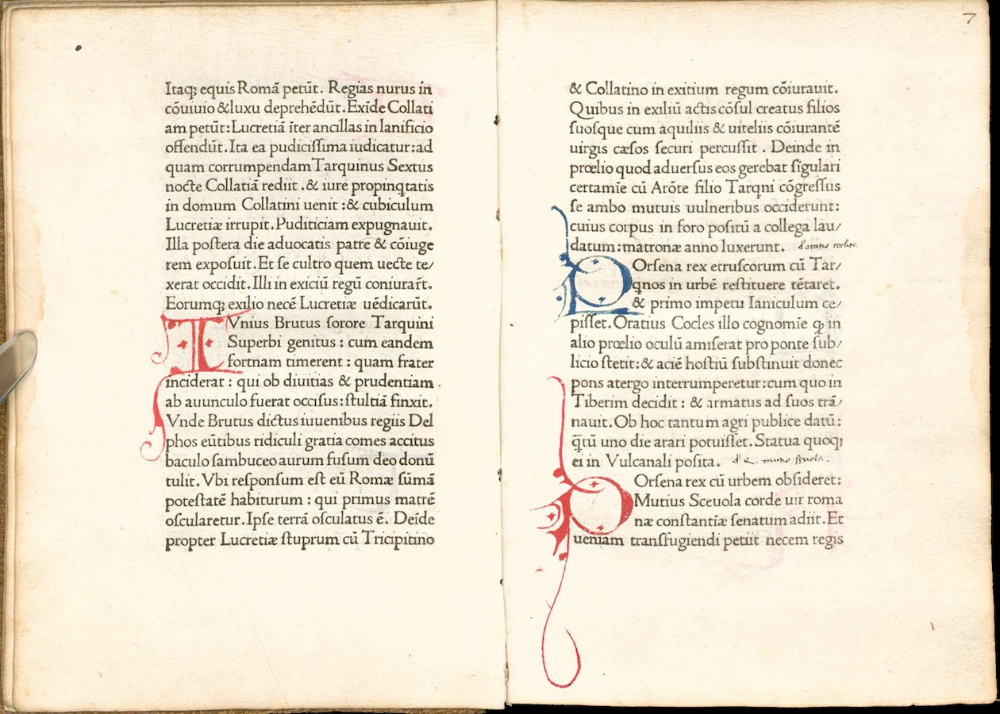

  

# Credit and labour in humanities projects

::: {#epigraph}
> We have to start taking seriously the systems of production and of reception in which digital scholarly objects and networks are continuously made and remade. If we fail to do this, we'll shortchange the work of faculty who experiment consciously with such fluidity — but worse: we will find ourselves in the dubious moral position of overlooking other people, including many non-tenure-track scholars, who make up those two systems.   
   – Bethany Nowviskie [^nowviskie2012]
:::

  
The INKE Project has a solid tradition of grappling with the issue of acknowledging collaborative credit and reconciling assertions of "authorship" with the complicated collaborative dynamics of a multi-participant, multi-modal, multi-specialty project. Both within and beyond the INKE community, a growing literature has emerged on the political economy of citation and collaboration in DH. [^inke]

These issues are not new. Academia is much like Publishing in that both are robust systems for the interchange of cultural, institutional, and financial capital. Both are fundamentally *status economies*, beyond any other goals or ideals they may serve. The most obvious manifestation of this is primacy of *authorship* as the fulcrum for exchange, status, identity, and power.[^foucault] But as digital, networked humanities scholarship has grown up around increasingly large and heterogeneous projects, the ethical and material problems of credit and collaboration have loomed large.

As scholars currently embarking on what we hope will become a large and heterogeneous digital humanities project -- the digital remediation of Simon Fraser University's Aldine collection -- these questions loom large for us too. Interestingly, we find in the very object of our study (500 years ago) some parallels which we think might be worth surfacing.
  
# The Aldine press as a humanities project
  
Aldus Manutius (1449–1515) was a humanist scholar and grammarian who, relatively late in his life, established a press in Venice with the aim of bringing classical Greek scholarship out of the relative obscurity of manuscript circulation. Beginning in 1495 his press' output spanned the classical Greek and Latin canon, contemporary humanist works, vernacular literature, and numerous grammars and language texts. In doing so he established himself as the most prestigious publisher of the Italian Renaissance and provided the prototype for modern publishers.

In a 2019 INKE presentation, Alessandra Bordini and I explored the Aldine press as a "centre for collaborative scholarship" and indeed as a Renaissance-era precursor to today's "open social scholarship":

> In printing and circulating—in thousands of copies—the most important texts of classical antiquity, Aldus succeeded in turning these works from inaccessible (and neglected) repositories of knowledge into widely distributed articulations of Renaissance learning.[^bordini2019]

Indeed, the Aldine press looks very much like a large digital humanities project -- except it wasn't 'digital.' At the time, however (the turn of the 16th century), the rise of print culture provides at least an analogy for the rise of digital culture. The Aldine press was a complex technical project -- quite literally "implementing new knowledge environments" and "prototyping in the humanities"; it concerned public access, user experience design, metadata, and preservation. It was a highly collaborative project -- both among humanist scholars and technical staff; its goals included innovation and indeed standardization of new forms of scholarly work.

## Aldus' legacy
  
Aldus' project, as both a scholarly enterprise and a commercial publishing operation, traded on the interchange of cultural and financial capital, and was thoroughly concerned with status and recognition as the means to the furtherance of its educational and scholarly ends. The success of the the press over time is manifest in the credit that accrued -- enduringly -- to Aldus: as progenitor of the "modern book;" as the "first publisher;" as a key innovator in typography, design, and editorial; as the steward of the classical canon; and so on.

These numerous expressions of status and importance are arguably justified, as many years of bibliography, book history, and Aldine scholarship have shown. Still, the equation of this wealth of innovation, idealism, and leadership with just one man is problematic. *Who did the actual work?* How did the group gathered around this press come together to create such important and lasting works? 

## What do we know about the Aldine press?
  
Aldus Manutius' life and work come at the tail end of the *incunabula* period, arguably opening up the modern world of books and print culture. The difficulties of doing serious historical research on this period -- when documentary sources are at best scarce and, worse, seriously biased in favour of very few writers -- mean that, despite the size of Aldus' reputation, there isn't that much historical record to go on. What there is instead is a robust *tradition* of stories about Aldus and his press. 

This tradition begins with Erasmus of Rotterdam, who spent some months in Venice during the preparation of his *Adages* (which appeared from the Aldine press in 1508), in which he memorializes Aldus, his colleagues, and his operation in the adage "Festina Lente" (*Hasten slowly,* the motto of the press and purported inspiration for the press' anchor-and-dolphin logo). Also influential is the canonical enumerative bibliography of the press, compiled by collector and book dealer Antoine-Augustin Renouard and published in several editions in France in the early 1800s. Renouard's work parallels the rise of a serious trade in Aldine editions by wealthy collectors around the world: surely the mythology of Aldus has helped to drive his collectability. And, of course, *vice-versa*.

In the 20th century, Giovanni Mardesteig, an Italian printer, led a contemporary renewal of interest in Aldus and in his typographic contributions. Mardesteig's work was paralleled in the UK by Stanley Morison, a typographer, amateur historian, and prolific writer who directed the creation and re-issue of numerous historical typefaces by the Monotype Corporation. In the English-speaking world, Morison's opinions of Aldus' printing innovations have been enormously influential. But not until Martin Lowry's 1979 biography *The World of Aldus Manutius* did a serious, well-researched (in part based on the recovered notebooks of Venetian diarist Martin Sanudo) study appear. Lowry's stated aim was to go beyond the traditional stories and find the "hard facts," but his success in this was limited. Most recently, Oren Margolis published a new biography of Aldus in 2023, which sheds new light, but still relies heavily on literary sources. We are no closer to knowing who did the actual work.[^lowry]

The effect of this tradition is the same accounts and framings are repeated over and over in the literature: Aldus' idealism, brilliance, sweeping vision, work ethic, and so on -- all qualities that flourish in the narrative treatments of Aldus' contemporaries and later admirers but are hardly the stuff of careful historical analysis.
  
The actual documentary and bibliographic record is quite discrete: Aldus left behind around one hundred editions published in his lifetime -- and the vast majority of these featured a preface by Aldus himself, sometimes addressed to patrons and benefactors and sometimes to students and 'readers' more generally. Only a tiny handful of paratextual material from the Press itself -- like catalogues -- survives. There is more documentary evidence from legal documents that touch on the operation and people surrounding the press: legal patronages (that is: official monopolies granted by the Venetian republic, somewhat like patents), wills and testaments, and judicial records. But this is patchy and selective too, and hardly outweighs Erasmus' dramatic re-tellings of how things were, in his *Adages* and *In Praise of Folly*.  
  
## Archival & bibliographic evidence
  
There is also the bibliographical evidence, which has been the subject of a good quantity of excellent scholarship in recent years: book and print historians prepared to do the hard work of close, sometimes microscopic analysis of what is actually in Aldus' books. Interestingly, some of this analysis only became possible with the advent of cheap and accessible photocopying and photographic enlargement.[^burnhill] And it is something that is becoming *much* easier and more accessible because of developments in what we might call open social scholarship: especially the Incunabula Short Title Catalogue,[^istc] the Universal Short Title Catalogue,[^ustc] and a growing wealth of online digitized collections using the IIIF (International Image Operability Framework).[^iiif] Indeed, our own project at SFU, involving the digital remediation of the Library's Wosk-McDonald collection of 126 Aldines, will make them available for close analysis via IIIF (and other nice features) hopefully within the coming year.

Open social scholarship also makes it easier to access scholarship from around the world, beyond the English-language collections of our library and its immediate peers.[^lang]

As the body of qccessible scholarship grows and the details of bibliographic evidence provide more clues, we begin to gain some purchase on the question of what really went on at the Aldine press.

  
## Recovering hidden colleagues I: *Andrea Torresani*
  
One of Aldus' colleagues is clear enough, because his name appears along with Aldus' in the colophons to the books. Andrea Torresani (variously *Torresano* and *Torresanus*; also *Andrea d'Asola*). Torresani was one of the original cohort of Venetian printers, going back to the 1470s; a member of *La Compangna* of Nicolas Jenson, the original Venetian printing powerhouse. After Jenson's death in 1480, Torresani was a significant Venetian printer in his own right, through to the end of the century. In early 1490s, Aldus formed a partnership with Torresani that lasted until the end of the 16th century. The historical tradition, however, treats him almost as a silent partner in the Aldine press. 
  
A major reason for this is that Erasmus did a total hatchet job on Torresani, portraying him as a cheap miser who watered the workers' wine, and implying that he cared only for money and nothing for Aldus' high-minded ideals. But even a cursory look at the history of the Aldine press complicates this picture, as Andrea was the experienced printer, and there is evidence that he and Aldus worked very closely over two decades. But the absence of Torresani's agency is notable in the tradition. And perhaps this is enough to dissuade historians from doing the hard work of tracking down Torresani in the records.
 
Here is where the ISTC -- and the IIIF -- come to our aid. It took only me an afternoon to review dozens of publications from Torresani's own print shop in the 1480s and 1490s, before he began to work with Aldus. Torresani printed quantities of legal and religious material: most of it very conservatively, certainly not the innovative designs and formats of the Aldine press. But there also appear the odd humanist text in Torresani's output; these are books that break the mold, and look surprisingly like the work that came out of the printing operation he ran with Aldus a decade later. Who was actually running the Aldine press? Surely it was the man with decades of experience, equipment, and staff. Aldus -- if we believe Erasmus (as well as Aldus' own accounts) -- was always preoccupied with correcting manuscripts.  
  
## Recovering hidden colleagues II: *Frau Ugelheimer*
  
Typographic tradition tells us that Nicolas Jenson perfected *roman* typography in 1470. This is to say that "roman" type -- the kind of typeface you grew up reading and are reading right now, as distinct from, say, gothic blackletter -- dates very specifically to the earliest Venetian printers.

Again, according to tradition, Aldus' punchcutter Francesco Griffo worked from Jenson's model in the late 1490s to produce Aldus' own roman type, a subtle variation on Jenson's letterforms; Stanley Morison famously championed this type as the prototype for all roman type going forward.[^morison]   
  
We know that Torresani had worked with Jenson, and later worked with Aldus, so there's a clear connection between these two printers. But another colleague, Peter Ugelheimer, was also a member of Jenson's *La Compagna*. Specifically, Ugelheimer was named in Jenson's will to inherit his punches (that is, the *masters* from which printing types are manufactured).[^jensonwill] Ugelheimer himself had a printing business after Jenson died in 1480. And when Ugelheimer died (1487), his wife Margarete took over the press. According to Tobias Daniels, it was Margarete who sold the punches to Torresani.[^daniels] We can tell from the ISTC holdings that Torresani printed with Jenson's type in the 1480s.

Interestingly, Margarete Ugelheimer appears later (again, in a legal document) as the sponsor of Aldus' printing the *Letters of St Catherine of Siena* in 1500 -- itself a typographic milestone for a variety of reasons. Andrea Torresani may have been ignored in the historiography because he was unpopular with Erasmus and the humanists; how much of Margarete Ugelheimer's contribution has been rendered invisible because she was a woman?
  
# Who gets the credit? Who did the work?
  
Aldus, as a rule, gets the credit for the whole operation. That is how this story has been told for many centuries. The only exceptions -- by Aldus' own word -- are the celebrity editors (scholars) like Pietro Bembo with whom he worked on specific manuscripts. And, interestingly:  the punchcutter Francesco Griffo,  credited by Aldus in the context of Aldus' request for a Venetian privilege -- effectively a patent -- for the italic printing type that appeared in 1501. 

Renaissance Venice was a status- and prestige-obsessed society with a roaring economy and no small amount of political and military tumult; cultivating high-placed friends was how Aldus made his way, not being a member of the patrician class himself.[^maclaque] Anyone who did not already have status was ignored and erased by those who sought status: labourers, colleagues, women.  

But the very fact of the Aldine press means that many hands did the work. And the scale of innovation and development happening there make it hard to believe that one singular genius was responsible for it all. Aldus may have been a successful leader -- a visionary, even -- but the range of skills and expertise required to make such change happen over years and decades required a cluster of talent, working hard together, and something of a culture of collaboration in order to sustain it. Again, we come back to the parallels with today's large (digital) humanist projects, with their Principal Investigators, their teams of students and junior scholars, librarians, technical specialists, bookkeepers, and lots of plain old labour.
  
## How differently do we think today?
  
The questions arising from our consideration of the Aldine press are not so different from the questions of credit in collaborative scholarly projects today: who does the work? who gets to matter? who gets counted? 

Evidently, in 1500 and today, *authors and scholarly editors* tend to get credit; while printers, copyeditors, typesetters, and technical contributors do not. Arguably this is an example of the class divide between *epistêmê* and *technê* that was first articulated by Aristotle: a class divide that has marked the university from its very beginnings. Oren Margolis, in his 2023 biography of Aldus, makes a strong case for Aldus as the first real "publisher" (as distinct from printer), on the model of the *architect* distinct from the builder. Thinker vs doer.

Indeed, today, the greater thrust of the literature grappling with issues of credit in collaborative projects is about *authorship:* about who gets to be part of the byline. Less is said about the technical contributors, staff, and 'labour' more generally, apart from the general admonition to mention such people in the acknowledgements. But as Rachel Mann pointed out, in *Debates in the Digital Humanities 2019*:

>  Given that an individual's contributions are more far-reaching than a detailed page of acknowledgments would ever begin to suggest, a “legible trail of credit” is not only impracticable but also risks short-changing members who are not listed as authors.[^mann]

This is a far cry from the motion picture industry's norms around closing credits. Bethany Nowviskie notes the institutional logic that leads to such a situation:
  
> ...discomfort with the way that our institutional policies, like those that govern ownership over intellectual property, codify status-based divisions among knowledge workers of different sorts in colleges and universities. These issues divide DH collaborators even in the healthiest of projects...[^nowviskie2]

More generally, Kathleen Fitzpatrick's analysis of how the culture of competition "has undermined the capacity for community-building."[^kfitz] shows how comparison, status-seeking, and individual exaltation is the norm for institutional credit, all the while effacing the necessary contributions staff, technicians, and those lower on the institutional and scholarly hierarchy. These are the forces that work against the valuing of complex collaboration. 

> The sense that education in the humanities is of primarily private value is everywhere in today's popular discourse extended to higher education in general: the purpose, we are told, of a college degree is some form of personal enrichment, whether financial (a credential that provides access to more lucrative careers) or otherwise (an experience that provides access to useful or satisfying forms of cultural capital).[^kfitz2]

## The Sociology of Texts
    
If we are to take seriously D.F. McKenzie's argument that bibliography is the *sociology of texts*, then we must be able to take account of Darcy Cullen's framing: "the social text [which] displaces the Author to bring into focus the multiple contributors to the making of text..."[^cullen] If this matters to us in our historical and bibliographic research, it matters also in our own projects and productions. The Aldine historical record gives us precious little of this sociology, apart from stories of the already-important. But self-consciously and reflexively -- drawing a parallel between the Aldine Press and contemporary DH projects --  we can least try to do better at this.  
 
---

# *An initial attempt at some credits:* Aldus@SFU

### Library Special Collections

Melissa Salrin, Special Collections Librarian, SFU  
Alexandra Wieland, Archivist, SFU Library    
Ewa Delanowski, Digital and Outreach Archivist, SFU Library   
David Kloepfer, Special Collections Assistant, SFU Library  
Tony Power, Special Collections, SFU Library  

### Digitization

Ian Song, Digitization librarian, SFU   
Donald Taylor, Scholarly digitization fund, SFU   
...*and the yet-unnamed student digitization staff!*   

### Metadata

Janette McConville, Cataloguer, SFU Library  
Keshav Mukundu, Research Data Librarian  
Janette McConville, Cataloguing, SFU Library  
Reese Irwin, English grad student  

### Bibliographic Analysis

Amanda Lastoria, Adjunct Professor, Publishing SFU  
Hailey Peterson, Master of Publishing   
Brenda Luies, Digital Fellow, Digital Humanities Innovation Lab   
Sophie Ashton, Digital Fellow, Digital Humanities Innovation Lab  

### Prototyping

Joey Takada, Developer, Digital Humanities Innovation Lab   
Michael Joyce, Developer, Digital Humanities Innovation Lab   
Rebecca Dowson, Digital Scholarship Librarian   
Mark Jordan, Associate Dean of Libraries, SFU   
John Willinsky, original ideation and scholarship  

### The Collection

Dr Yosef Wosk, philanthropist and scholar   
Hugh McDonald (1920–2001), collector   
The McDonald Family, philanthropists   
Ralph Stanton, Special Collections Librarian in 1990s   
Eric Swanick, Special Collections Librarian in 2000s   
Melanie Hardbattle, Archivist, SFU Library   
Ann McDonnell, Library Advancement   

### Funding & Support

Kim O'Donnell, Research Grants Facilitator, FCAT   
Social Sciences and Humanities Research Council  
Implementing New Knowledge Environments Partnership  

### Project Leads:

Alessandra Bordini, PhD Student, SFU   
John W Maxwell, Assoc Professor, Publishing, SFU   

:::{#refs}

# References

Adema, Janneke, and Samuel Moore. “The Copim Perspective on Scale.” Copim, November 20, 2024. https://doi.org/10.21428/785a6451.a3867955.

Adema, Janneke, and Samuel A. Moore. “Scaling Small; Or How to Envision New Relationalities for Knowledge Production.” Westminster Papers in Communication and Culture 16, no. 1 (March 22, 2021). https://doi.org/10.16997/wpcc.918.

Barnes, Lucy, and Rupert Gatti. “Bibliodiversity in Practice: Developing Community-Owned, Open Infrastructures to Unleash Open Access Publishing.” In ELPUB 2019 23d International Conference on Electronic Publishing. OpenEdition Press, 2019. https://doi.org/10.4000/proceedings.elpub.2019.21.

Bath, Jon, Alyssa Arbuckle, Constance Crompton, Alex Christie, and Ray Siemens. “Futures of the Book.” In The Routledge Companion to Media Studies and Digital Humanities, edited by Jentery Sayers, 336–44. Routledge, 2018. https://doi.org/10.4324/9781315730479-35.

Bell, Kirsten. “Open Access and the Subjunctive Mood in Scholarly Publishing.” In Egalitarian Dynamics: Liminality, and Victor Turner’s Contribution to the Understanding of Socio-Historical Process, edited by Bruce Kapferer and Marina Gold, 1st ed. Berghahn Books, 2024. https://doi.org/10.2307/jj.14086448.

Endres, Bill. “A Literacy of Building: Making in the Digital Humanities.” In Making Things and Drawing Boundaries, edited by Jentery Sayers, 44–54. Experiments in the Digital Humanities. University of Minnesota Press, 2017. https://doi.org/10.5749/j.ctt1pwt6wq.7.

Fitzpatrick, Kathleen. Planned Obsolescence: Publishing, Technology, and the Future of the Academy. New York: NYU Press, 2011.

Galey, A., and S. Ruecker. “How a Prototype Argues.” Literary and Linguistic Computing 25, no. 4 (December 1, 2010): 405–24. https://doi.org/10.1093/llc/fqq021.

Grendler, Paul F. Aldus Manutius: Humanist, Teacher, and Printer. Providence, R.I.: John Carter Brown Library, 1984. http://archive.org/details/aldusmanutiushum00gren.

Harris, Neil. “Aldus and the Making of the Myth (Or What Did Aldus Really Do?).” In Aldus Manutius: La Costruzione Del Mito, 346–85. Venice: Marsilio, 2016.

Ingalls, Dan. “Vision and Image,” 2005.

Kelty, Christopher. Two Bits: The Cultural Significance of Free Software. Duke University Press, 2008. http://twobits.net.

Leonelli, Sabina. “Philosophy of Open Science.” Elements in the Philosophy of Science, July 2023. https://doi.org/10.1017/9781009416368.

Lowry, Martin. The World of Aldus Manutius: Business and Scholarship in Renaissance Venice. Ithaca, N.Y.: Cornell University Press, 1979.

Margolis, Oren. Aldus Manutius: The Invention of the Publisher. Renaissance Lives. Reaktion Books, 2023. https://press.uchicago.edu/ucp/books/book/distributed/A/bo208669787.html.

Maxwell, John W. “Pop! Launching a Post-Digital Journal in the Pandemic.” IDEAH, July 28, 2021. https://doi.org/10.21428/f1f23564.9213a838.

McKenzie, D. F. Bibliography and the Sociology of Texts. Cambridge: Cambridge University Press, 1999.

Moore, Samuel A. “Revisiting ‘the 1990s Debutante’: Scholar-Led Publishing and the Prehistory of the Open Access Movement.” Journal of the Association for Information Science and Technology n/a, no. n/a (October 2019). https://doi.org/10.1002/asi.24306.

Pooley, Jefferson. “Before Progress. On the Power of Utopian Thinking for Open Access Publishing,” 2024.

Ruecker, Stan. “A Brief Taxonomy of Prototypes for the Digital Humanities.” Scholarly and Research Communication 6, no. 2 (October 14, 2015). https://doi.org/10.22230/src.2015v6n2a222.

Saklofske, Jon and INKE Research Group. “Digital Theoria, Poiesis, and Praxis: Activating Humanities Research and Communication through Open Social Scholarship Platform Design.” Scholarly and Research Communication 7, no. 2/3 (November 8, 2016). https://doi.org/10.22230/src.2016v7n2/3a252.

Stadler, Matthew. “What Is Publication?” Presented at the Richard Hugo House’s writer’s conference, *Finding Your Audience in the 21st Century*, Portland, September 11, 2010. http://vimeo.com/14888791.

:::

[^nowviskie2012]: Nowviskie, Bethany. “Evaluating Collaborative Digital Scholarship (or, Where Credit Is Due).” *Journal of Digital Humanities 1*, no. 4 (Fall 2012). https://journalofdigitalhumanities.org/1-4/evaluating-collaborative-digital-scholarship-by-bethany-nowviskie/.

[^inke]: See e.g., Siemens, Lynne and INKE Researh Group. “From Writing the Grant to Working the Grant: An Exploration of Processes and Procedures in Transition.” *Scholarly and Research Communication 3*, no. 1 (March 26, 2012). https://doi.org/10.22230/src.2012v3n1a49;  Mann, Rachel. “Paid to Do but Not to Think: Reevaluating the Role of Graduate Student Collaborators.” In Debates in the Digital Humanities 2019, edited by Matthew K. Gold and Lauren F. Klein, 268–78. University of Minnesota Press, 2019. https://doi.org/10.5749/j.ctvg251hk; Nowviskie. "Where Credit is Due."

[^foucault]: This idea was first elaborated, but certainly not exhausted, by Foucault, Michel. “What Is an Author?” In *Aesthetics, Method, and Epistemology*, edited by James D. Faubion. New York, 1999.

[^bordini2019]:  Bordini, Alessandra, & John Maxwell. “Breaking SFU Aldines Out of the Vaults: Aldus Manutius and Open Social Scholarship in the Sixteenth Century.” *Pop! Public. Open. Participatory 1*, no. 1 (October 31, 2019). https://popjournal.ca/issue01/bordini.

[^lowry]: Lowry, Martin. *The World of Aldus Manutius: Business and Scholarship in Renaissance Venice*. Ithaca, N.Y.: Cornell University Press, 1979. Margolis, Oren. *Aldus Manutius: The Invention of the Publisher*. London: Reaktion Books, 2023;  Margolis. “Hercules in Venice: Aldus Manutius and the Making of Erasmian Humanism.” *Journal of the Warburg and Courtauld Institutes 81*, no. 1 (January 1, 2018): 97–126. https://doi.org/10.1086/JWCI26614765.

[^burnhill]: Two particularly good bits of analytic bibliography are Burnhill, Peter. *Type Spaces: In-House Norms in the Typography of Aldus Manutius*. London: Hyphen Press, 2003. https://hyphenpress.co.uk/products/books/type_spaces/; and Olocco, Riccardo. “I Romani Di Francesco Griffo.” *Bibliologia 7* (2012): 33–56. https://www.riccardolocco.com/img/Romani%20del%20Griffo_Olocco_Bibliofilia7.12.pdf.

[^istc]: The Incunabula Short Title Catalogue (ISTC), created by the British Library. See https://data.cerl.org/istc/_search

[^ustc]: The Universal Short Title Catalogue (USTC), hosted by the University of St. Andrews. See https://www.ustc.ac.uk/

[^iiif]: The International Image Interoperability Framework (IIIF) provides an open API and image-browsing interfaces to digitized collections. See https://iiif.io/

[^lang]: See Olocco 2012; see also a review article in English by British historian Lotte Hellinga, of a German book, published in an Italian journal. Hellinga, Lotte. “Recensioni: Hinter Dem Pergament: Der Frankfurter Kaufmann Peter Ugelheimer Und Die Kunst Der Buchmalerei Im Venedig Der Renaissance by Christoph Winterer.” *La Bibliofilia 120*, no. 3 (2018): 481–86. https://www.jstor.org/stable/10.2307/26869643.

[^morison]: See Morison, Stanley, and Kenneth Day. *The Typographic Book, 1450-1935*. University of Chicago Press, 1963. 31ff.

[^daniels]: Hellinga, "Recensioni."

[^mann]: Mann. "Paid to Do but Not to Think."

[^cullen]: Cullen, Darcy. *Editors, Scholars, and the Social Text*.  Edited by Darcy Cullen. Studies in Book and Print Culture. University of Toronto Press, 2012. p19.

[^kfitz]: Fitzpatrick, Kathleen. *Generous Thinking: A Radical Approach to Saving the University*. Baltimore: Johns Hopkins University Press, 2019.

[^maclaque]: Erin Maglaque traces the fraught boundary dynamics of the Patrician class in *Venice’s Intimate Empire: Family Life and Scholarship in the Renaissance Mediterranean*. Ithaca, N.Y.: Cornell University Press, 2018. https://www.cornellpress.cornell.edu/book/9781501721656/venices-intimate-empire/.

[^kfitz2]: Fitzpatrick, *Generous Thinking*, 33

[^nowviskie2]: Nowviskie. "Where Credit is Due."

[^jensonwill]: Jenson's will is reproduced in Lowry, Martin. *Nicholas Jenson and the Rise of Venetian Publishing in Renaissance Europe*. Oxford: Basil Blackwell, 1991.

