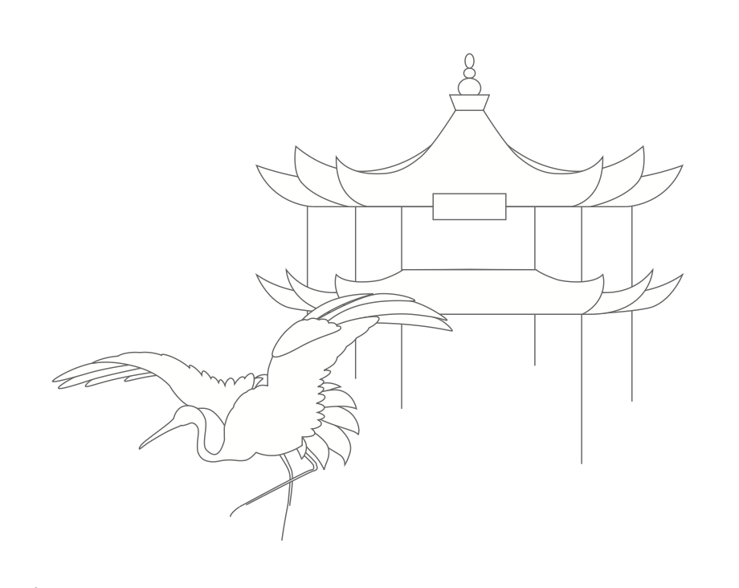
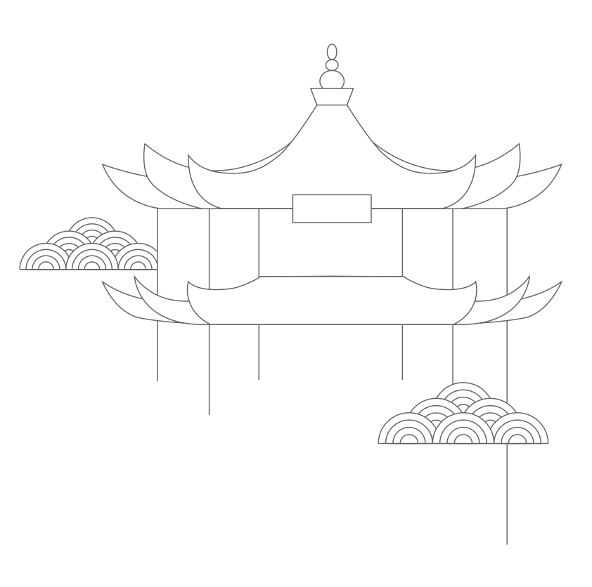

# 一 诗应当不言 / 而自明   I. A poem should not mean / but being.

:::{.pair}
:::{.poem {.chinese lang="cn"}
## 万古烧

| 我买了一口好锅
| 可以用一辈子的那种
| 陶土的，有松木盖的
| 只要天塌不下来
| 我就可以一直用它
| 煲汤，烧肉
| 但更多的时候我宁愿
| 它就那样闲置着
| 像我一样空空如也
| 却不可测度
:::

:::{.poem {.english lang="en"}
## THE EVERLASTING POT

| I bought a good pot
| one that can last a whole life
| made of clay, with a pinewood lid
| As long as the sky does not collapse
| I can use it all the time
| to cook soup, stew meat
| But more often I’d rather
| it just lay idle there
| like me, empty
| yet unfathomable
:::
:::

:::{.pair}
:::{.poem {.chinese lang="cn"}
## 写诗是……

| 写诗是干一件你从来没有干过的活
| 工具是现成的，你以前都见过
| 写诗是小儿初见棺木，他不知道
| 这么笨拙的木头有什么用
| 女孩子们在大榕树下荡秋千
| 女人们把毛线缠绕在两膝之间
| 写诗是你一个人爬上跷跷板
| 那一端坐着一个看不见的大家伙
| 写诗是囚犯放风的时间到了
| 天地一窟窿，烈日当头照
| 写诗是五岁那年我随我哥哥去抓乌龟
| 他用一根铁钩从泥洞里掏出了一团蛇
| 我至今还记得我的尖叫声
| 写诗是记忆里的尖叫和回忆时的心跳
:::

:::{.poem {.english lang="en"}
## WRITING POETRY IS …

| Writing poetry is doing something you have never done before
| the tools are off the shelf, and you have seen them all
| Writing poetry is seeing a coffin; the child doesn’t know
| what to make out of the clumsy wood
| Girls are swinging under the big banyan tree
| and women are winding yarn with their knees
| Writing poetry is you mounting onto a seesaw
| at the other end of which sits an invisible big fellow
| Writing poetry is an inmate being let out to exercise
| in the hole between heaven and earth, and in the scorching sun
| Writing poetry is me at five catching turtles with my elder brother
| who using a metal hook dragged out from a mud hole a twine of snakes
| I still remember my shrill screams
| Writing poetry is screaming in memory and heart pounding in reminiscing
:::
:::

:::{.pair}
:::{.poem {.chinese lang="cn"}
## 左对齐

| 一首诗的右边是一大块空地
| 当你在左边写下第一个字
| 脑海里立刻浮现出一个栽秧的人
| 滴水的手指上带着春泥
| 他将在后退中前进
| 一首诗的右边像弯曲的田埂
| 你走在参差不齐的小道上
| 你的脚踩进了你父亲的脚印中
| 你曾无数次设想过这首诗的结局
| 而每当回到左边
| 总有一种意犹未尽的感觉
| 一首诗的左边是一个久未归家的人
| 刚刚回家又要离开的那一刻
| 他一只脚已经迈出了门槛
| 另外一只还在屋内
| 那一刻曾在他内心里上演过无数次
:::

:::{.poem {.english lang="en"}
## LEFT ALIGN

| To the right of a poem is vast empty space
| When you write down the first word on the left
| the image of a man transplanting rice seedlings comes to the mind
| Water dripping from his mud-coated fingers
| he shall march forward as he moves backwards
| To the right of a poem is the curvy ridge of rice fields
| Walking on the uneven surface
| your feet stamp into the footprints of your father
| You have thought countless times about the poem’s end
| yet whenever you return to the left
| you feel you still have not fully expressed yourself
| To the left of a poem is a man who has left home too long
| The moment he arrives home he’s ready to depart again
| his one foot is already outside of the threshold
| and his other still inside
| That moment he had once rehearsed numerous times
:::
:::

:::{.pair}
:::{.poem {.chinese lang="cn"}
## 笤帚经过大地的

| 声音
| 笤帚经过大地的声音
| 被我在这个秋天制造了出来
| 在这首诗中我看见了你屋后的竹林
| 你父亲用皲裂的虎口掐回一捆毛毛竹
| 他插在腰间的篾刀上有三个豁口
| 他胸前的扣子不知什么时候掉了两颗
| 他制造的这把笤帚被你带到了秋天
| 烧荒的烟雾从林中空地升起来
| 夜风在这首诗中随意吹拂
| 我制造了一种声音——它
| 紧贴干硬的混凝土，紧贴着
| 这秋天里的每一个清晨和黄昏
| 如果你父亲还活着
| 此刻他一定在某个角落
| 用你熟悉又陌生的那双手
| 紧锁着自己的领口
:::

:::{.poem {.english lang="en"}
## SOUND OF A BROOM SWEEPING ACROSS THE EARTH

| The sound of a broom sweeping across the earth
| has been created by me this fall
| In the poem I see a bamboo grove behind your house
| where the chapped hands of your father gathered a bundle of bamboo sticks
| Three chips showed up on his bamboo knife
| Two buttons missing from the front of his shirt at unknown times
| You brought this broom made by him into autumn
| In an open area in the forest smoke from burning waste grass rose into the sky
| Night wind blew at will in this poem
| I created a sound—it
| stays close to hard concrete, close to
| each dusk and dawn of this fall
| Were your father still alive
| at present he would be in a certain corner
| his hands familiar and strange to you
| covering his collar
:::
:::

:::{.pair}
:::{.poem {.chinese lang="cn"}
## 在黑暗中写诗

| 最近多有失眠
| 身处黑暗像一个靶子
| 被诗句冷不丁射中
| 拔箭的时候发现
| 有的箭矢穿心而去
| 无影无踪，而有的
| 根本就没有命中靶心
| 在黑暗中写诗
| 每写一句都有如光柱射往虚空
| 我用过最多五节电池的电筒
| 我身体里的光已经透支
| 它们去得最远的地方
| 也是你最不愿意
| 让我看见的伤心处
:::

:::{.poem {.english lang="en"}
## WRITING POETRY IN DARKNESS

| Recently I have suffered much from insomnia
| Situated in darkness like a target
| I was surprised by onslaughts of poetic lines
| pulling the arrow only to reveal
| some arrows had penetrated through the heart
| and went traceless, while others
| totally missed the target’s center
| Writing poetry in darkness
| each line like a beam of light towards emptiness
| I’ve used as powerful a flashlight as a 5-cell
| exhausting all that’s in me
| The farthest place the lines have reached
| is heartbreaking recess that
| you do not want me to access
:::
:::

:::{.pair}
:::{.poem {.chinese lang="cn"}
## 梦见一首诗

| 有时候我会梦见一首诗
| 她在梦中的样子无比清晰
| 她握我的手像小时候
| 我用力捏紧铅笔头
| 笔芯折断了
| 我鼓足勇气找她借转笔刀
| 我梦见一首诗在跳房子
| 而我在一旁摇跳绳
| 绳子的另一端拴在无皮的枣树干上
| 我梦见我使劲摇动地上的尘土
| 像牛犊发了狂，前撅后拱
| 我看见她闭上眼睛越跳越高
| 我梦见所有的事物都是发光体
| 我一转身它们就熄灭
| 有时候我在一首诗里闪烁
| 梦醒之后才发现
| 我从来不曾带走过任何梦中之物
:::

:::{.poem {.english lang="en"}
## I DREAM OF A POEM

| Sometimes I dreamed of a poem
| her appearance in my dream incredibly clear
| She held my hand as in childhood
| I held my pencil head so tightly and hard
| that the point broke
| and I had to muster the courage to borrow her sharpener
| I dreamed of a poem playing hopscotch
| while I was turning a rope
| its other end tied to the thin trunk of a jujube tree
| I dreamed of myself spinning the rope to bring up dust
| like a crazy calf, my belly protruding and my back arching
| I see her closing her eyes and jumping higher and higher
| In my dream all things were glowing
| but as soon as I turned my back they dimmed
| Sometimes I would glow in a poem
| Once waking up I would find
| I could never retrieve anything from my dreams
:::
:::

:::{.pair}
:::{.poem {.chinese lang="cn"}
## 玫瑰与月季

| 当一个诗人无法说出
| 诗是什么的时候
| 玫瑰与月季在一旁竞相开放
| 当一首诗呼之欲出
| 诗人的鼻尖上沁出了汗珠
| 而她的脸颊上泛出了玫瑰红
| 月季开出了玫瑰的花
| 玫瑰在一旁默默承受
| 我爱的女人无一不热爱花朵
| 而我爱她们趋身花丛时的尖叫
| 而不深究什么是月季什么是玫瑰
| 当我终于有了爱的自觉
| 诗是什么已经不重要了
| 重要的是我已经学会了如何
| 将偶然之爱混淆于必然之爱中
:::

:::{.poem {.english lang="en"}
## ROSE AND CHINESE ROSE

| When a poet cannot explain
| what poetry is
| rose and Chinese rose compete to open up next to one another
| When a poem is on the tip of the tongue
| the tip of the poet’s nose sweats
| while rosy color capers on her cheeks
| The Chinese rose bears the flowers of the rose
| while the rose endures in silence
| Each woman I adore without exception loves flowers
| while I love to hear her squeals as she falls for the flowers
| without being bothered by the differences between the two roses
| When I am finally conscious of love
| what poetry is no longer matters
| What matters is that I’ve learned
| to envelop accidental love into inevitable love
:::
:::

:::{.pair}
:::{.poem {.chinese lang="cn"}
## 关于我的睡姿

| 我没有见过我的睡姿
| 当我像虾米一样
| 蜷曲 , 或者像个十字架形
| 我能感觉到身体正在挣脱
| 梦中人赋予它的原形
| 我总是在入睡前翻来覆去
| 而入睡后难道会像一片云？
| 我这样设计过
| 与你同床共枕
| 的情景——两朵云
| 如胶似漆叠加在一起
| 雨在下面，雨一直在下
| 我一直这样保持着干涸的模样
| 像你小时候在泥塘里见过的
| 那条挣扎着的鱼
| 当它放弃了挣扎
| 也就完成了命运对它的塑形
:::

:::{.poem {.english lang="en"}
## ABOUT MY SLEEPING POSITION

| I have never seen my sleeping position
| When like a shrimp
| I curl up, or spread like a cross
| I can feel my body breaking free from
| the shape the dreamer endowed it
| I often toss and turn in bed before falling asleep
| Is it possible I act like a cloud during sleep?
| I have imagined
| sharing a bed with you
| like this—two clouds
| stick to each other like lacquer
| rain underneath falling all along
| and I remain dried up the whole time
| like what you saw in the pond during childhood
| a flopping fish
| when it gave up wiggling
| fate also shaped it as meant to be
:::
:::

:::{.pair}
:::{.poem {.chinese lang="cn"}
## 冰箱贴

| 做菜的间隙
| 我时常打量
| 形状各异的
| 冰箱贴
| 这些五颜六色的
| 小东西都是我
| 从各地搜集来的
| 代表着世界
| 大和美
| 此生我见过人间的一部分
| 还有余力去更多的地方
| 所以需要一口好冰箱
| 储存足够的食物
| 我需要
| 用动物的眼睛看待
| 锅里的和碗里的
| 再用人类的目光端详
| 看不穿的生活
| 那是亲爱的皮囊
| 制造出来的动静
| 我将成全我
| 在明朗的人间
| 做一个风尘仆仆的人
:::

:::{.poem {.english lang="en"}
## FRIDGE MAGNETS

| During cooking breaks
| I often examine
| the varied shaped
| magnets on my fridge
| These colorful
| knickknacks
| collected by me from different places
| represent the world
| its size and beauty
| I have seen parts of the world
| and still have energy to cover more
| So I need a good refrigerator
| to stock an adequate amount of food
| I need to
| adopt animals’ eyes to deal with
| what’s in the pot and what’s in my bowl
| and use human perspective to scrutinize
| the inscrutable life
| which is my dear body’s
| own doings
| I shall enable myself
| to become in this bright world
| a weary, way-worn wanderer
:::
:::

:::{.pair}
:::{.poem {.chinese lang="cn"}
## 据我所知

| 并无真正摆脱了写的诗
| 当诗成为必需，写下
| 就意味着和上帝对掷骰子
| 我父亲用沉默的一生告诉我
| 失败并非多么难堪之事
| 这个终生都不认他父亲的男人
| 临终之际哀求我
| 一定要弄清楚他的父亲是谁
| 据我所知，诗歌无法回答
| 这么高深莫测的问题
| 诗歌长在耕耘过的田间地头
| 在种子埋下去之后
| 在菜花盛开之前
| 这段时间充满了不确定性
| 我乐于在暮春回家
| 尾随在一个个消逝的背影后面
| 他们也是掷过骰子的人
| 输得心平气和
| 而越是平静，就越能靠近
| 所谓的诗意，据我所知
| 写诗的目的就是为了能成为
| 这样一位不知所踪的父亲
:::

:::{.poem {.english lang="en"}
## AS FAR AS I KNOW

| I am not really detached from my poetry
| When poetry becomes a necessity, writing
| means throwing dice with God
| My father taught me with his whole life
| failing is not so embarrassing
| This man who never acknowledged his own father
| beseeched me at his death bed
| to figure out who his father had been
| As far as I know, poetry cannot answer
| such an unfathomable question
| Poetry grows from tilled fields
| After seeds are sown
| before rapeseed flowers bloom
| is a period of uncertainty
| I enjoy returning home in late spring
| following the back view of many disappeared
| They flung dice as well and
| they remained calm at their failure
| Yet the calmer they were, the closer they were
| to what is known as the poetic. As far as I know
| the purpose of writing poetry is
| to become such an elusive father
:::
:::

:::{.pair}
:::{.poem {.chinese lang="cn"}
## 被词语找到的人

| 平静找上门来了
| 并不叩门，径直走近我
| 对我说：你很平静
| 慵懒找上门来了
| 带着一张灰色的毛毯
| 挨我坐下，将毛毯一角
| 轻轻搭在我的膝盖上
| 健忘找上门来了
| 推开门的时候光亮中
| 有一串灰尘扑扑的影子
| 让我用浑浊的眼睛辨认它们
| 让我这样反复呢喃：你好啊
| 慈祥从我递出去的手掌开始
| 慢慢扩展到了我的眼神和笑容里
| 我融化在了这个人的体内
| 仿佛是在看一部默片
| 大厅里只有胶片的转动声
| 当镜头转向寂寥的旷野
| 悲伤找上门来了
| 幸存者爬过弹坑，铁丝网和水潭
| 回到被尸体填满的掩体中
| 没有人见识过他的悔恨
| 但我曾在凌晨时分咬着被角抽泣
| 为我们不可避免的命运
| 为这些曾经以为遥不可及的词语
| 一个一个找上门来
| 填满了我
| 替代了我
:::

:::{.poem {.english lang="en"}
## FOUND BY WORDS

| Peace approached my door
| instead of knocking, it walked straight to me
| uttering: You look peaceful
| Ennui approached my door
| with a grey wool blanket
| sitting by my side to lay a corner of the blanket
| gently onto my knees
| Forgetfulness approached me
| when it pushed open my door, and in brightness
| a line of dusty shadows
| asked me to identify them with my cloudy eyes
| and to murmur repeatedly: hi
| Kindness spread from my extended palms
| slowly to my eyes and smile
| I melt inside this human being
| as if viewing a silent movie
| in a hall where only the turning of the films was audible
| When the camera directed towards the desolate wilderness
| sadness approached my door
| The survivor climbed over craters, barbed
| wire, and water puddles
| to return to the bunker full of dead bodies
| No one saw his repentance
| but I once chewed the quilt corner and sobbed at dawn
| for our unavoidable destiny
| for those previously elusive words that have
| one by one
| replenished me
| and replaced me
:::
:::

:::{.pair}
:::{.poem {.chinese lang="cn"}
## 到树顶上找风

| 有时候我们需要爬到树顶上
| 去寻找风。有时候
| 我们散布在房前屋后的
| 柳树、槐树、皂角树和苦楝树下
| 抱紧树身往树上爬
| 有时候我们需要沿途使劲
| 摇晃树枝，大声呼唤着
| 慢慢从树梢上探出头
| 有时候我探出头看见
| 你的父亲在芝麻地里蠕动
| 他的母亲还在河边割猪草
| 有时候我看见田间里的稻草人
| 好像换了一件外套
| 我们从树上溜下来
| 踩着牛背，或牛角
| 牛蝇扇动的风只有牛蝇感觉到了
| 有时候我们就这样爬上爬下
| 耗尽了汗水，目的是
| 等雨水来重新把我们滋润
:::

:::{.poem {.english lang="en"}
## SEARCHING FOR THE WIND ON TREETOPS

| Sometimes we needed to climb to the treetops
| to search for the wind. Other times
| we spread out around the house
| under willows, pagoda trees, honey locusts, and chinaberries
| and climbed by holding the trunks tightly
| Still other times we needed to vehemently
| shake the branches, holler loudly
| and then slowly stick out our head from the treetops
| Sometimes I would poke my head out to see
| your dad crawling in a sesame field
| and his mom still cutting grass by the river for pigs
| Other times I would see the field’s scarecrow
| in a new outfit
| and we would slip down the trees
| mount onto a buffalo, or hold onto its horn
| while only the gadflies felt the wind they stirred up
| Still other times we would repeatedly climb up and down
| shed all sweat, and let
| the rain nurture us one more time
:::
:::

:::{.pair}
:::{.poem {.chinese lang="cn"}
## 高原上的野花

| 我愿意为任何人生养如此众多的小美女
| 我愿意将我的祖国搬迁到
| 这里，在这里，我愿意
| 做一个永不愤世嫉俗的人
| 像那条来历不明的小溪
| 我愿意终日涕泪横流，以此表达
| 我真的愿意
| 做一个披头散发的老父亲
:::

:::{.poem {.english lang="en"}
## WILD FLOWERS ON THE PLATEAU

| I’d love to sire for anyone so many little beauties
| I’d love to move my homeland
| here; and here, I’d love to
| be one who is never cynical
| like that creek of unknown origins
| I’d love to shed grateful tears all day long, to convey
| my genuine willingness
| to be the old father with billowing hair
:::
:::

# 二 用心，这是我们永远 要做的正经事   II. To pay attention, this is our endless and proper work.

:::{.pair}
:::{.poem .chinese lang="cn"}
## 断流河抒怀

| 每一条河流都有自己的出路
| 当第一滴暴雨落在荆山之巅
| 这雨滴就意识到了若干年后
| 若干年后我站在干涸的河床上
| 仰望喧嚣的星空，每一滴星光
| 都那么微弱而倔强，就像我
| 卑微而倔强地走在这条断流河上
| 身前身后都是滔滔巨浪
| 生前生后都有人潮汹涌
:::

:::{.poem .english lang="en"}
## THOUGHTS ON THE DRYING–UP RIVER

| Each river ends at the river’s mouth
| When the first raindrop of a storm fell on the summit of Mt. Jing
| it already knew its final place years later
| Years later I stand on a dried-up riverbed
| Up in the starry sky, I see light
| weak yet willful, just like me
| humble and headstrong walking on this dried-up river
| Before and behind me there were torrential waves
| Before and after my life, waves of people
:::
:::

:::{.pair}
:::{.poem {.chinese lang="cn"}
## 旅游札记

| 我有对床的恐惧
| 越是宽大整洁的床
| 这恐惧越盛
| 冬天即将来临
| 旷野不再拥挤
| 我有对旅途中孤零零的客栈的恐惧
| 怀着不安再看一眼
| 清凉的落日，和
| 浸泡在窗外河道里的枯枝
| 关上门窗
| 我坐在堆着四只枕头的床上
| 仿佛坐在地球上最荒凉的地方
| 这么宽大而整洁的荒凉
| 像这首诗一样
:::

:::{.poem {.english lang="en"}
## TRAVEL NOTES

| I am afraid of beds
| The more immaculate and bigger the bed is
| the more intense my fear
| Winter is coming
| and the wilderness is no longer crowded
| I am afraid of this lonesome inn on my journey
| Nervously I take another look
| at the cooling sunset, and
| dying branches on the riverbed outside the window
| With the window closed
| I sit among four pillows on my bed
| as if sitting in the most desolate place on earth
| Such vast and immaculate desolation
| feels just like this poem
:::
:::

:::{.pair}
:::{.poem {.chinese lang="cn"}
## 看不见大海的河流

| 岩子河永远也不会看见大海
| 我父亲也没有见过
| 平日里，河水慵懒
| 只有在暴雨过后它才激动起来
| 我问过父亲：河水会流向哪里？
| 父亲摇摇头，过后又指指天
| 这两个动作让我想了很多年
| 多年以后我从海边归来
| 独自坐在泄洪道口
| 刚下过暴雨，白浪奔逐
| 我在轰鸣声中想起了
| 父亲的那两个动作
| 摇头时我满脸水雾
| 抬头见烟雨中的老父亲
| 正在堤坝上使劲地朝我挥手
:::

:::{.poem {.english lang="en"}
## THE RIVER THAT WOULD NEVER SEE THE SEA

| The Yanzhi River would never see the sea
| neither would my father
| Oftentimes, the river was lackadaisical
| getting excited only after a storm
| I once asked my father: Where will it reach?
| He shook his head, and then pointed to the sky
| I deliberated over his reaction for many years
| Years later I returned from the sea
| As I sat alone at the floodgates of the spillway
| waves were chasing one another after the storm
| In their crashing sounds I recalled
| my father’s reaction
| When he shook his head I was clueless
| When I lifted my head in misty rain I saw him
| waving hard to me from the riverbank
:::
:::

:::{.pair}
:::{.poem {.chinese lang="cn"}
## 一点生活

| 超市总把盐袋放在角落
| 那地方你一年也光顾不了几次
| 而在自家的厨房里
| 盐罐被摆放在显眼的位置
| 一只青花瓷瓶已经有些年份
| 瓶盖并非原配
| 你站在灶台边，往滚烫的油锅内
| 扔一些冷冰冰的东西
| 你喜欢听它们的嗞嗞声
| 这声音唤醒了很多年前的
| 某个午时，黄昏
| 你趴在灶沿看母亲
| 在烟雾中挥舞锅铲
| 来回翻炒着寡淡的锅底
| 从那时起你就相信
| 津津有味的生活源于这
| 一丝丝清晰的记忆
:::

:::{.poem {.english lang="en"}
## A PINCH OF LIFE

| The grocery store always tucks away the salt in a corner
| which you frequent no more than a few times a year
| while in your own kitchen
| the salt jar is always placed in a prominent position
| The blue and white porcelain jar has seen better years
| covered by a lid that’s not the original
| You stand by the cooktop, throwing into the pan of boiling oil
| some cold ingredients
| You love the sizzling sounds
| that awakes memory of years past
| a certain afternoon, near dusk
| you watched from the cooking area your mother
| wielding a spatula in the smoke
| and stirring this way and that the dull bottom of a pot
| Since then you’ve believed
| palatable life originates from
| traces of clear memories
:::
:::

:::{.pair}
:::{.poem {.chinese lang="cn"}
## 芡实与菱角

| 巨大的木盆漂浮
| 在更为巨大的水面上
| 年幼的我坐在水盆中央
| 这是我第一次离开陆地
| 前往芡实和菱角的家乡
| 巨大的秋阳照耀着平静的水面
| 我在明晃晃的年纪里就有了
| 湿漉漉的记忆，这记忆
| 通往芡实和菱角的家乡
| 大人们关心水下有什么
| 而我只对水面上的事物感兴趣
| 用力划动的木盆左摇右晃
| 我要去我从没去过的地方
| 我要采摘那些水中的果实
| 把它们运回陆地
| 把它们的家乡运回我的家乡
:::

:::{.poem {.english lang="en"}
## FOX NUTS AND BAT NUTS

| The large wood bucket floated
| on the even larger water surface
| me the little boy sitting in the bucket center
| It was my first sailing away from the land
| to the home of fox nuts and bat nuts
| The large autumn sun shone on the placid water
| and I gained at a glowing age
| wet memories, memories leading to
| the hometown of fox nuts and bat nuts
| The adults were interested in what’s beneath the water
| while I was only keen on what’s above
| Rowing and rocking the bucket left and right
| I shall travel to places I had never been
| I shall harvest the fruits of water
| I shall transport them to the land
| I shall move their hometown to mine
:::
:::

:::{.pair}
:::{.poem {.chinese lang="cn"}
## 反刍的人

| 埋在米糠里的鸡蛋
| 封在坛子里的猪油
| 挂在屋梁上的腊肉
| 晾在簸箕上的薯干
| 摊在筛子里的腌鱼
| 倒扣在腌菜坛中的辣椒
| 堆放在火塘角落的花生
| 藏在竹林地窖里的红薯
| 悬在树丫上的丝瓜和葫芦
| 沉睡在草丛中的老南瓜
| ——哦，十根指头
| 已经不够用了
| 第十一根是香烟
| 供你在饭后反刍
| 第十二根是铁钉
| 好多年前就被钉在了墙上
| 好多年前它就已经生锈了
| 当它什么都不挂的时候
| 它连锈迹也挂不住
:::

:::{.poem {.english lang="en"}
## THE ONE WHO RUMINATES

| Eggs buried in rice bran
| Lard sealed in a jar
| Bacon hanging from the roof beam
| Sliced potatoes drying in a winnowing fan
| Salted fish lying in a traditional sieve
| Peppers pressed upside down in the pickling crock
| Peanuts piled in a corner near the firepit
| Sweet potatoes stored away in a cellar in the bamboo forest
| Luffas and gourds dangling from tree branches
| Old pumpkins slumbering in the grass
| — Oh, ten fingers
| are already not enough for counting
| The eleventh is for cigarettes
| to accompany your rumination
| The twelfth is a nail
| driven into the wall many years ago
| rusting since years ago
| When it holds nothing
| it can hardly support the rust
:::
:::

:::{.pair}
:::{.poem {.chinese lang="cn"}
## 到梦里去

| 直到昨晚我才发现
| 所谓睡眠
| 不过是牧羊人
| 在天黑之前把四散在天边的
| 羊群赶进栅栏
| 每一只羊都有
| 一个月明星稀的夜晚
| 每一位牧羊人身边
| 都有一堆干牛粪
| 昨天晚上我发现
| 我仍是脱缰之马可供你消遣
| 到梦里去
| 到梦里去
| 我的羊群慢慢聚拢
| 背靠背在黑暗中
| 挤成一团
| 而你在月光下甩打响鞭
| 每抖一下手腕
| 我就往你胸前靠近一点
:::

:::{.poem {.english lang="en"}
## TO ENTER YOUR DREAM

| I did not realize until last night
| the so-called sleep
| is nothing but the shepherd
| before dark gathering his widely scattered
| flock into the pen
| Each sheep gets
| a moonlit night
| Each shepherd has by his side
| a pile of dry cow dung
| Last night I realized
| I am still that wild horse for you to rein
| in your dream
| To enter your dream
| my flock is gradually gathering
| and back-to-back in darkness
| huddling
| When you crack your whip in moonlight
| each move of your wrist
| brings me closer to your chest
:::
:::

:::{.pair}
:::{.poem {.chinese lang="cn"}
## 翠鸟的一天

| 河面上有一层白雾
| 太阳光顾岩子河半晌了
| 还没有散开
| 翠鸟站在河沿边光秃秃的野枣枝上
| 像一颗意外的野枣
| 随时准备弹向更意外的地方
| 从前的小河流着流着
| 变成了一座水库
| 那些清粼粼的时光仿佛不曾有过一样
| 但翠鸟能证明这世上并不存在幻象
| 它贴近水面一遍遍疾飞
| 就像当年站在岸边打水漂的少年
| 从早到晚都在努力
| 将一片片石头送过
| 越来越宽阔的河面
:::

:::{.poem {.english lang="en"}
## A DAY OF THE KINGFISHER

| The Yanzhi River wears a white veil of fog
| The sun has shown above the river for a while
| but has not spread its light
| The kingfisher stands by the river on a wild jujube’s bare branch
| like an accidental jujube date
| ready to catapult to a more accidental place
| The erstwhile stream flowed and flowed
| and has turned into a reservoir
| as if all those clear and crystalline days had not existed
| Yet the kingfisher proves there were no illusions
| It takes repeated flights, fast and close to the water’s surface
| just like the young man once did, skimming stones on the bank
| from morning till night without giving up
| sending stone after stone across
| the ever-widening river
:::
:::

:::{.pair}
:::{.poem {.chinese lang="cn"}
## 雨没有下透

| 牛尾在午后的田埂上来回甩动
| 这自我鞭策的活物
| 总有一天会走远走出我的生活
| 但在此之前，泥泞依然
| 天地严丝合缝
| 从牛背上溜下来的人
| 被牛蝇惹恼了，抓起荆条
| 来回抽打自己的后背和前胸
| 这自我鞭策的活物
| 总有一天会来到我的眼前
| 在这首郁闷的诗中与我
| 相恨，相逢
:::

:::{.poem {.english lang="en"}
## THE RAIN ABATED TOO SOON

| On the afternoon field ridges buffalo tails sway to and fro
| Such self-motivated creatures
| one day will surely walk far away and out of my life
| But before that, it’s still muddy
| and heaven and earth leave no opening for getaway
| He who slides down from the back of a buffalo
| annoyed by gnats, grabs twigs of chaste trees
| and beats repeatedly his front and back
| Such a self-motivated creature
| one day will surely appear before me
| in this depressing poem
| to regret meeting late
:::
:::

:::{.pair}
:::{.poem {.chinese lang="cn"}
## 找信号的人

| 我的朋友魏天无给我讲过
| 一个故事，故事的主人公
| 生活在祁连山深处
| 那天他要通过 QQ 视频参加
| 农村生源自主招生面试
| 到了约定的时间
| 却没有出现在视频中
| 事后考官们才知道他没有电脑
| 他当时正翻山越岭寻找手机信号
| 我无数次想象过这样的
| 镜头：一个青年举着手机
| 奔跑在山岗上
| 山顶摇晃，永远不够高
| 他一边跑一边对着镜头大呼小叫
| 再也没有更高的山了
| 再也没有比先前诅咒过
| 如今还需要再诅咒一遍的生活
| 更让人无可奈何的了
| 我曾无数次陷在这样的生活中
| 张开嘴巴，却一言不发
:::

:::{.poem {.english lang="en"}
## HE WHO SEARCHES FOR THE SIGNAL

| My friend Wei Tianwu once told me
| a story, the protagonist of which
| lived deep in the Qilian Mountains
| That day the young man was scheduled for a video interview
| for independent enrollment of students from rural areas
| But by the interview time
| he did not show up
| Later the examiners learned he lacked a computer
| and was looking for phone signals all over the mountaintop
| I have replayed in my mind many times
| such a scenario: a young man holding a cell phone
| runs on a mountaintop
| The mountaintop wobbles, never high enough for any signals
| While running the young man shouts to the phone
| No higher spots
| This fucking
| and today fucked up again life
| Nothing sucks more than this
| I had been trapped countless times in such a life
| mouth wide open yet silent
:::
:::

:::{.pair}
:::{.poem {.chinese lang="cn"}
## 一只蚂蚁出门了

| 一只蚂蚁出门了
| 早上我在小花园门口看见它
| 晚上我在石拱桥头看见它
| 一只蚂蚁有好运气
| 我祝它明天也像今天
| 能够翻过一具具尸体
| 还能背着多余的
| 尸体回家
:::

:::{.poem {.english lang="en"}
## AN ANT VENTURED OUT

| An ant ventured out
| In the morning I saw it at the gate of the small garden
| At dusk I came across it near one end of the bridge
| The ant was lucky
| I wish tomorrow, as today, it can also
| crawl over corpse after corpse
| and even bring extra
| corpses home
:::
:::

:::{.pair}
:::{.poem {.chinese lang="cn"}
## 在涠洲岛看落日

| 我在涠洲岛上看见了最纯粹的落日
| 我在日落大海之际看见了
| 最真实的我，可以对视的
| 那个我，接受了孤独和黑暗的我
| 圆满的一天将终结于此
| 幸福的人在沙滩上像孩子
| 来回寻找被潮汐带上岸的杂什
| 幸福的沙子随波逐流
| 却没有卑微之感
| 我在一年将尽之时走到了自己的身旁
| 我挨我坐下就像终于挨着了你
| 手指轻拍膝盖
| 身体里有呼啸声应和着
| 闪烁的波浪，动荡的太平洋
| 我知道，这是我仍有把握
| 以诗之身活在人间的真正原因
:::

:::{.poem {.english lang="en"}
## SUNSET VIEW ON WEIZHOU ISLAND

| I saw the purest sunset on Weizhou Island
| I saw at the moment the sun touched the sea
| my truest self, the one that could stand
| gaze, the one that absorbed loneliness and darkness
| A perfect day was drawing to its end
| Happy people like children on the beach
| sought back and forth what tidal waves brought onshore
| Happy sand drifted along with the flow
| without feeling insignificant
| I approached myself in the very last moment of the year
| I sat down, side by side with myself, as if with you
| a finger gently tapping on the kneecap
| inside me a roaring sound resonating with
| the glistening waves, the turbulent Pacific Ocean
| I knew, with certainty, why
| my body could still live in this world as a poet
:::
:::

:::{.pair}
:::{.poem {.chinese lang="cn"}
## 抓一把硬币逛菜市

| 每当活不下去的时候
| 我会立即起身
| 从鞋柜上的钱罐里
| 抓起一把硬币
| 去菜市场闲逛
| 每当我叮当作响
| 走在人群中，内心里
| 有一种无法抑制的快乐在涌动
| 这快乐近似于我小时候
| 摇晃着积攒的钱罐
| 站在榆钱树下等候货郎的身影
| 我在五颜六色的菜市摊旁
| 一遍又一遍走着
| 当硬币花光时
| 某种一名不文的满足感
| 让我看上去不是一般的幸福
:::

:::{.poem {.english lang="en"}
## GO TO THE FOOD MARKET WITH A HANDFUL OF COINS

| When I feel unable to live anymore
| I rise like a shot
| from the piggy bank on the shoe cabinet
| grab a handful of coins
| and take a stroll through the food market
| When the coins jingle
| as I walk among the crowds, my heart
| feels the surge of uncontrollable joy
| It resembles what I felt when as a little boy
| I shook my piggy bank
| waiting under an elm tree for the itinerant vendor
| I saunter among the colorful food stands
| round and round
| When the coins are gone
| a certain sense of penniless satisfaction
| makes me look unusually happy
:::
:::
